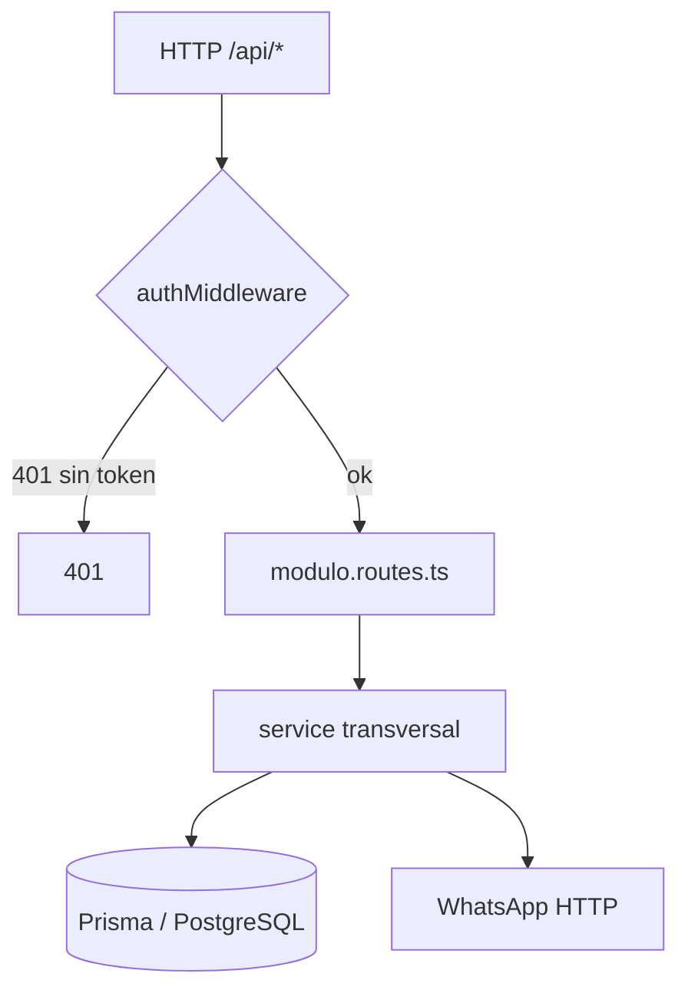
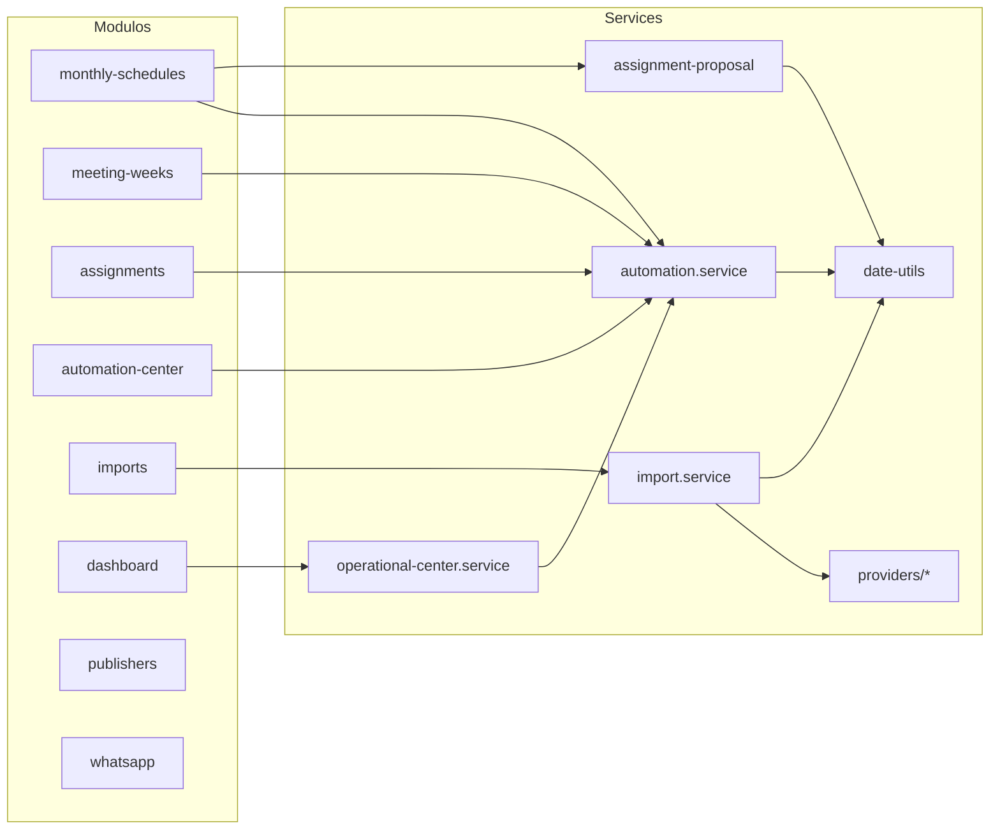

# BACKEND ARCHITECTURE

> API REST de JW-REMINDERS. Carpeta: `apps/api`. Framework: Express 4. Puerto 4000.
> Patron: modulos por dominio (HTTP) + services transversales (logica). Acceso a datos via Prisma.

---

## 1. Bootstrap y capas

`src/server.ts` arma la app Express: `helmet`, `cors`, `express.json()` y monta `apiRouter` bajo `/api`. `src/routes/index.ts` registra cada modulo.



Capas:
- **routes** (`modules/*/*.routes.ts`): parsing/validacion de entrada (zod), codigos HTTP, delega.
- **services de modulo** (`modules/*/*.service.ts`): logica del dominio del modulo (cuando es compleja).
- **services transversales** (`services/*`): reglas reutilizadas por varios modulos (automatizaciones, propuestas, importacion, fechas).
- **middleware** (`middleware/auth.ts`): JWT Bearer.
- **datos**: Prisma Client de `@jw-reminders/database`.

No hay capa formal de "repositories": Prisma es el repositorio. Los services encapsulan las transacciones.

---

## 2. Mapa de rutas

`src/routes/index.ts` monta (auth es publico; el resto pasa por `authMiddleware`):

| Prefijo | Modulo | Responsabilidad |
|---|---|---|
| `/api/auth` | auth | Login, emision de JWT (publico) |
| `/api/dashboard` | dashboard | Centro Operativo (agregacion) |
| `/api/config` | config | AppConfig (TIMEZONE/TEST_MODE/...) |
| `/api/publishers` | publishers | CRUD publicadores (soft delete) |
| `/api/meeting-weeks` | meeting-weeks | Semanas + `:id/generate-automations` |
| `/api/monthly-schedules` | monthly-schedules | Programas: detalle, generar semanas/asignaciones, automatizaciones masivas, propuestas |
| `/api/imports` | imports | `providers`, `preview`, `confirm` |
| `/api/assignments` | assignments | CRUD + `generate-reminders`, `cancel`, `complete` |
| `/api/reminders` | reminders | Consulta de recordatorios |
| `/api/automation-center` | automation-center | Supervision + `deliveries/:id/retry|cancel`, overview |
| `/api/message-templates` | message-templates | Plantillas de mensaje |
| `/api/message-logs` | message-logs | Historial de mensajes |
| `/api/whatsapp` | whatsapp | Proxy a estado/acciones de WhatsApp |

---

## 3. Modulos (responsabilidad y dependencias)



- **auth**: `auth.service` valida credenciales (bcrypt) y firma JWT.
- **publishers**: CRUD; soft delete (`deletedAt`); flags de elegibilidad.
- **meeting-weeks**: crea/edita semanas; al cambiar fecha/hora regenera automatizaciones de asignaciones `SCHEDULED`; `generateWeekAutomations` genera por semana (omite `PROPOSED`). DELETE archiva si hay historial, borra si vacia.
- **monthly-schedules**: el modulo mas grande. Detalle con metricas, `generate-weeks`, `generate-assignments`, automatizaciones masivas (`generate/regenerate/cancel`), estados (`COMPLETED` etc.), y **propuestas** (`generate/regenerate/discard/approve/proposal`).
- **assignments**: CRUD; `generate-reminders` (rechaza `PROPOSED`); `cancel`/`complete` disparan cancelacion/archivado de automatizaciones. `updateAssignment` regenera si la asignacion ya tenia automatizacion.
- **automation-center**: overview operativo, listado filtrable de entregas, `retry`/`cancel` de entregas.
- **imports**: delega en `import.service` + `providers`.
- **dashboard**: delega en `operational-center.service` (agrega todo el estado del sistema).
- **whatsapp**: reenvia a `WHATSAPP_API_URL` (estado/acciones).

---

## 4. Services transversales

### `services/automation.service.ts` — Motor de automatizaciones (nucleo)
Crea y gobierna planes y entregas. Funciones clave:
- `createAutomationPlanForAssignment(tx, assignmentId, opts)`: calcula la siguiente `version`, crea `AutomationPlan` (DRAFT->ACTIVE), genera `ReminderDelivery` por cada regla aplicable, marca la asignacion `SCHEDULED`. **Resiliente**: si una regla es invalida (p.ej. SAME_DAY con `sendHour >= meetingTime`) se omite esa entrega y el resto se genera.
- `regenerateAssignmentAutomation`: marca el plan activo `SUPERSEDED`, cancela entregas pendientes y recrea (sin INITIAL, con `CHANGE_NOTICE`).
- `cancelAssignmentAutomation`: cancela entregas pendientes y crea `CANCELLATION_NOTICE`.
- `archiveAssignmentAutomation`: cancela pendientes y archiva el plan.
- Reglas: `ASSIGNED_RULES = [INITIAL, 7d, 3d, 1d, SAME_DAY]`, `COMPANION_RULES = [INITIAL, 3d, 1d, SAME_DAY]`.
- `INITIAL_NOTICE`, `CHANGE_NOTICE`, `CANCELLATION_NOTICE` se programan **de inmediato** (`now`); los demas, relativos a la fecha de reunion y `sendHour`.
- Helpers compartidos: `publisherSnapshot`, `applyAssignmentSnapshots`, `createAutomationEvent`, `getAutomationConfig` (lee `AppConfig`).

### `services/assignment-proposal.ts` — Generador de propuestas (puro)
`buildAssignmentProposal({weeks, publishers, history, slots?, options?})` — funcion **determinista y sin efectos**. Reparte equilibrando carga del mes (peso dominante) y desempatando por historial, penalizando parejas frecuentes, respetando elegibilidad y "no repetir persona en la misma semana". Cubierto por pruebas unitarias. Detalle en `PROVIDERS-ARCHITECTURE.md`/`REPORTE-FINAL`.

### `services/import.service.ts` — Motor de importacion
`parseProgram -> validateProgram -> normalizeProgram` (puras, testeadas) + `previewImport` (sin persistir) y `confirmImport` (crea programa + semanas + `AssignmentTemplate`). Consume la capa `providers`. Ver `PROVIDERS-ARCHITECTURE.md`.

### `services/date-utils.ts` — Tiempo y zonas horarias
`calculateReminderScheduledAt`, `zonedLocalTimeToUtc`, `addDaysToLocalDate`, `localToday`, `localDateLabel`, `localTimeLabel`, `dateToLocalDateString`. Centraliza la conversion local<->UTC (zona `AppConfig.TIMEZONE`, default `America/Mexico_City`). Tiene pruebas unitarias.

### `modules/dashboard/operational-center.service.ts` — Centro Operativo
`getOperationalCenter()` agrega en una llamada: estado del sistema (worker/scheduler/WhatsApp/TEST_MODE), programas, semanas, propuestas, automatizaciones (hoy/manana/7/vencidas/fallidas/canceladas), publicadores, flujo recomendado dinamico, alertas y calendario. Solo lectura/agrega; no muta estado.

---

## 5. Autenticacion y seguridad

- `auth.routes`/`auth.service`: valida usuario+password (bcrypt) y firma JWT con `JWT_SECRET`.
- `middleware/auth.ts`: exige `Authorization: Bearer <jwt>`; verifica y adjunta `req.user`. 401 si falta o invalido.
- Todas las rutas excepto `/api/auth` van protegidas.
- **Limitaciones** (ver `TECHNICAL-DEBT.md`): sin RBAC, sin refresh tokens, sin rate limiting, fallback `JWT_SECRET || "secret"`.

---

## 6. Validacion y manejo de errores

- Entradas validadas con **zod** en las rutas (schemas `createSchema`/`updateSchema`). Errores de validacion -> 400 con `{ error }`.
- Servicios lanzan `Error` con mensaje en espanol; las rutas los convierten a 400/404/500.
- Operaciones compuestas usan `prisma.$transaction` (con `timeout` ampliado en las masivas) para atomicidad.
- El motor de automatizaciones es resiliente por regla (no aborta todo por un fallo puntual).

---

## 7. Worker y scheduler (resumen)

El **scheduler** es `node-cron` dentro de `apps/worker` (no en la API). Procesa `ReminderDelivery` debidas y llama al servicio WhatsApp. La API no envia mensajes: solo crea/gestiona las entregas. Detalle completo en `WORKER-ARCHITECTURE.md`.

---

## 8. Providers e importadores (resumen)

`services/providers/` define la **interfaz** `MeetingProgramProvider` y el `registry`. `import.service` ejecuta el pipeline `Provider -> Parser -> Validator -> Normalizer -> persistencia`. Detalle en `PROVIDERS-ARCHITECTURE.md`.

---

## 9. Dependencias del backend (quien depende de quien)

```mermaid
flowchart TD
  API[apps/api] --> DB[(packages/database)]
  API --> SH[packages/shared]
  WK[apps/worker] --> DB
  WK --> SH
  WK -.HTTP.-> WAS[apps/whatsapp]
  WAS --> DB
  WEB[apps/web] -.HTTP.-> API
  DB --> PRISMA[@prisma/client]
  API --> EXP[express] & ZOD[zod] & JWT[jsonwebtoken] & BC[bcryptjs]
```

- `@jw-reminders/database` (Prisma) es dependencia de api, worker y whatsapp. Es el unico que toca la BD.
- `@jw-reminders/shared` (enums/constantes/render) es dependencia de api, worker y web. **No** depende de Prisma ni Express (paquete puro).
- `apps/web` solo depende de `shared` (en build) y de la API por HTTP.
- Dependencias externas notables: express, zod, jsonwebtoken, bcryptjs, helmet, cors (api); node-cron (worker); whatsapp-web.js + puppeteer (whatsapp); next/react/tailwind (web).

Auditoria de dependencias innecesarias/acoplamiento: ver `TECHNICAL-DEBT.md`.
