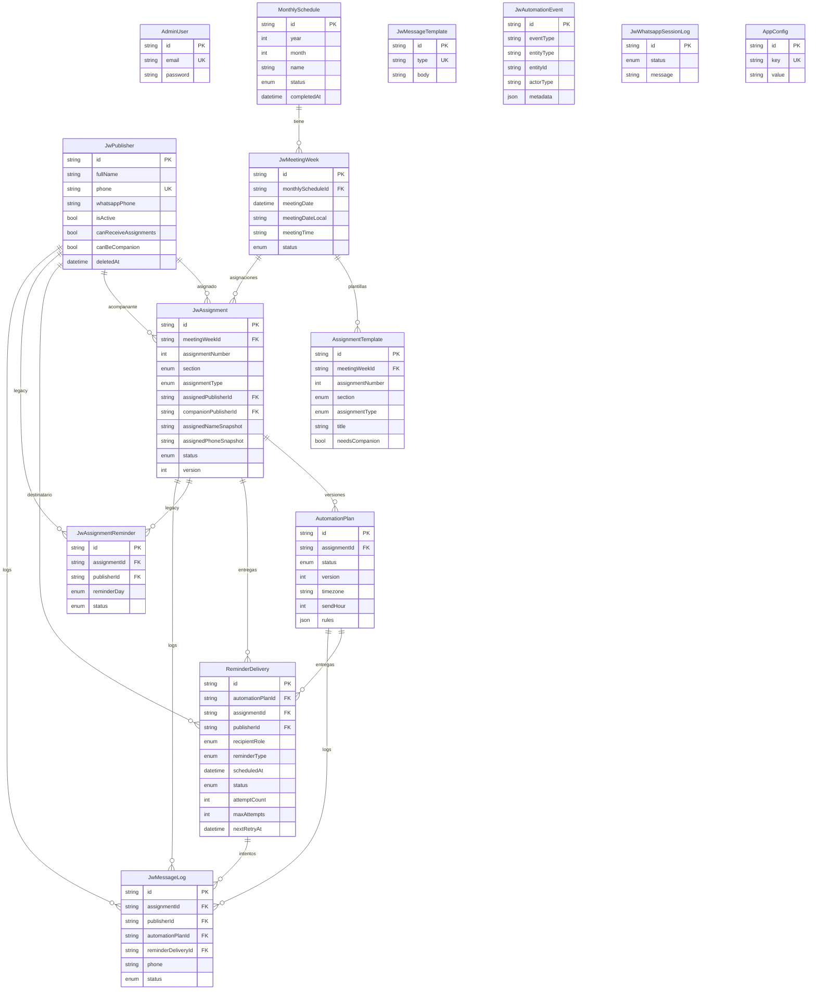
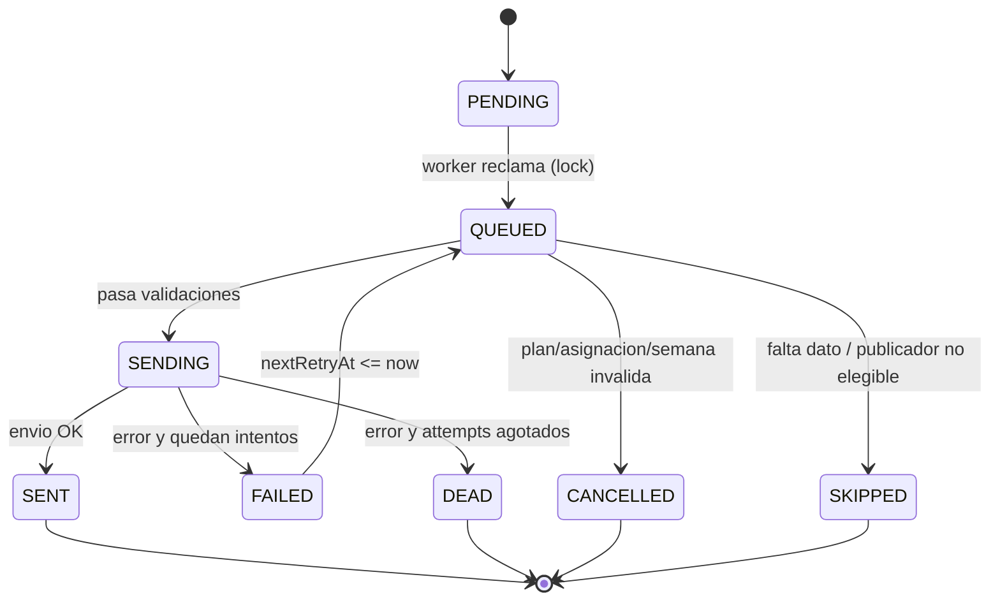

# DATABASE ARCHITECTURE

> Modelo de datos completo de JW-REMINDERS. Fuente de verdad: `packages/database/prisma/schema.prisma`.
> Motor: PostgreSQL 16. ORM: Prisma 5.22. IDs: `cuid()` (texto). Timestamps: `createdAt`/`updatedAt`.

El modelo de datos es el corazon del sistema: la coordinacion entre API, worker y WhatsApp ocurre via estados de filas, no via memoria compartida.

---

## 1. Diagrama ER

`JwAutomationEvent`, `JwWhatsappSessionLog`, `AppConfig` y `AdminUser` no tienen llaves foraneas (son transversales): se omiten relaciones en el diagrama.

---

## 2. Tablas (que es, por que existe, claves/indices)

### AdminUser
Usuarios administradores del panel.
- `email UK`, `password` (bcrypt). Sin roles: un unico nivel admin.
- **Por que**: autenticacion del panel. No modela publicadores (esos son `JwPublisher`).

### JwPublisher
Personas que reciben asignaciones / actuan como acompanantes.
- Telefonos: `phone UK` (obligatorio) y `whatsappPhone` (opcional; preferido al enviar).
- Flags de elegibilidad: `isActive`, `canReceiveAssignments`, `canBeCompanion`.
- `deletedAt` (**soft delete**): nunca se borra fisicamente para preservar historial.
- Campos futuros ya previstos: `congregationId`, `email`, `birthDate`, `tags`, `metadata` (Json) — habilitan multi-congregacion sin migracion disruptiva.
- **Por que existe**: catalogo de destinatarios + reglas de quien puede ser asignado o acompanante (usado por el generador de propuestas y por el worker antes de enviar).

### MonthlySchedule
Programa mensual: contenedor de las semanas de un mes.
- `@@unique([year, month])`: un programa por mes.
- `status`: `MonthlyScheduleStatus`. Marcas temporales `completedAt`/`archivedAt`/`cancelledAt`.
- **Por que existe**: punto de partida de la planificacion (P2). Centraliza metricas y acciones masivas del mes.

### JwMeetingWeek
Una semana/reunion concreta dentro de un programa.
- `monthlyScheduleId FK` (opcional: una semana puede crearse suelta y luego asociarse).
- Fechas **duplicadas** a proposito: `meetingDate` (DateTime UTC, medianoche) y `meetingDateLocal` (string `YYYY-MM-DD`). Lo mismo con `weekStartDate`/`weekStartDateLocal`. El string local evita desfases de zona horaria al renderizar y al calcular ventanas.
- `meetingTime` (`HH:MM`), `congregationName`, `status` (`MeetingWeekStatus`).
- Indices: `@@index([monthlyScheduleId])`, `@@index([status])`.
- **Por que existe**: la unidad operativa real (las asignaciones y recordatorios cuelgan de una semana con fecha/hora).

### AssignmentTemplate (P4)
Plantilla de una parte de la semana (Lectura, Empiece conversaciones, Discurso, etc.) **sin persona asignada**.
- `@@unique([meetingWeekId, assignmentNumber])`, `@@index([meetingWeekId])`.
- Campos: `order`, `section`, `assignmentType`, `title`, `durationMinutes`, `needsCompanion`, `room`, `reference`, `source` (provider que la creo).
- FK a `JwMeetingWeek` con `ON DELETE RESTRICT` (no se borra una semana con plantillas sin limpiar antes).
- **Por que existe**: separa la **estructura** del programa (que partes hay) de la **asignacion** (quien). El generador de propuestas usa estas plantillas como "slots" cuando existen.

### JwAssignment
Asignacion concreta: una parte de una semana asignada a un publicador (y opcional acompanante).
- FKs: `meetingWeekId`, `assignedPublisherId`, `companionPublisherId?`.
- **Snapshots**: `assignedNameSnapshot`, `assignedPhoneSnapshot`, `companionNameSnapshot`, `companionPhoneSnapshot`. Congelan el dato al momento para que el historial no mute si el publicador cambia.
- `status` (`AssignmentStatus`: PROPOSED/DRAFT/SCHEDULED/COMPLETED/CANCELLED), `version` (incrementa en cada cambio relevante), `completedAt`/`cancelledAt`.
- Indices: `@@index([meetingWeekId, status])`, `@@index([assignedPublisherId])`, `@@index([companionPublisherId])`.
- **Por que existe**: nucleo del dominio. `PROPOSED` permite proponer sin que sea definitivo (P3); `DRAFT` = aprobada; `SCHEDULED` = con automatizacion activa.

### AutomationPlan
Plan de automatizacion **versionado** por asignacion.
- `@@unique([assignmentId, version])`, `@@index([assignmentId, status])`.
- `status` (`AutomationPlanStatus`), `timezone`, `sendHour`, `meetingDateLocal`, `meetingTimeLocal`, `rules` (Json: que recordatorios contempla).
- Marcas `cancelledAt`/`supersededAt`/`archivedAt`.
- **Por que existe**: hace auditable y reversible la generacion. Regenerar no borra: crea una version nueva y marca la anterior `SUPERSEDED`. Las entregas viejas se cancelan; las nuevas se crean.

### ReminderDelivery
La **entrega** concreta de un recordatorio a un destinatario (la "cola" que consume el worker).
- `@@unique([automationPlanId, publisherId, reminderType])`: evita duplicar el mismo recordatorio para el mismo destinatario dentro de un plan.
- FKs: `automationPlanId`, `assignmentId`, `publisherId`. `recipientRole` (ASSIGNED/COMPANION), `reminderType`.
- Programacion/estado: `scheduledAt`, `sentAt`, `status` (`ReminderStatus`), `attemptCount`, `maxAttempts` (3), `nextRetryAt`, `lastAttemptAt`, `deadAt`, `errorMessage`, `cancelledAt`, `cancelReason`.
- Indices criticos: `@@index([status, scheduledAt])` (consulta del worker), `@@index([assignmentId, status])`, `@@index([publisherId, status])`, `@@index([automationPlanId, status])`.
- **Por que existe**: separa "que se debe enviar y cuando" del envio fisico. Permite reintentos, backoff, cancelacion y locking optimista sin una cola externa.

### JwAssignmentReminder (LEGACY)
Modelo previo de recordatorios (antes del par AutomationPlan/ReminderDelivery del P0).
- `@@unique([assignmentId, publisherId, reminderDay])`. Campos `automationPlanId?`, `generationKey?`.
- **Por que existe**: compatibilidad/historico. **No se usa en el flujo actual**; candidato a retiro (ver `TECHNICAL-DEBT.md`).

### JwMessageTemplate
Plantillas de texto de los mensajes por tipo.
- `type UK` (incluye `INITIAL_NOTICE_ASSIGNED`, `INITIAL_NOTICE_COMPANION`, y los tipos de `ReminderType`). `body` con variables `{{var}}`.
- **Por que existe**: el worker renderiza el mensaje desde aqui (`template-renderer.ts`) usando `renderTemplate` de `shared`. Editable desde el panel.

### JwMessageLog
Registro inmutable de cada **intento** de envio.
- FKs opcionales a `assignment`, `publisher`, `automationPlan`, `reminderDelivery`. `phone`, `messageType`, `messageBody`, `providerMessageId`, `status` (`MessageLogStatus`), `errorMessage`, `sentAt`.
- Indices: `@@index([automationPlanId])`, `@@index([reminderDeliveryId])`.
- **Por que existe**: historial real de mensajes (que texto se envio, a que numero, con que resultado). Alimenta "Historial" y el detalle de entregas.

### JwAutomationEvent
**Bitacora de auditoria** de todo el ciclo.
- `eventType`, `entityType`, `entityId`, `actorType` (admin/system/worker), `actorId?`, `metadata` (Json).
- Indices: `@@index([eventType])`, `@@index([entityType, entityId])`, `@@index([createdAt])`.
- **Por que existe**: trazabilidad. El Centro Operativo lo usa para detectar actividad del worker, contar propuestas aprobadas/descartadas e importaciones.

### JwWhatsappSessionLog
Historial de transiciones de la sesion de WhatsApp.
- `status` (`WhatsappSessionStatus`), `message`.
- **Por que existe**: diagnostico de la conexion (READY/QR_REQUIRED/DISCONNECTED/...).

### AppConfig
Configuracion operativa clave-valor editable en caliente.
- `key UK`, `value`. Claves: `TIMEZONE`, `REMINDER_SEND_HOUR`, `TEST_MODE`, `TEST_PHONE`, `CONGREGATION_NAME`.
- **Por que existe**: cambiar comportamiento (zona horaria, hora de envio, modo prueba) sin redeploy. El worker la lee en cada tick.

---

## 3. Enums

| Enum | Valores | Usado en |
|---|---|---|
| `Gender` | MALE, FEMALE | JwPublisher |
| `AssignmentSection` | BIBLE_READING, APPLY_YOURSELF | Assignment/Template |
| `AssignmentType` | BIBLE_READING, START_CONVERSATION, MAKE_RETURN_VISIT, BIBLE_STUDY, EXPLAIN_BELIEFS, MAKE_DISCIPLES, TALK, OTHER | Assignment/Template |
| `Room` | MAIN, AUXILIARY | Assignment/Template |
| `AssignmentStatus` | PROPOSED, DRAFT, SCHEDULED, COMPLETED, CANCELLED | JwAssignment |
| `ReminderType` | INITIAL_NOTICE, SEVEN_DAYS_BEFORE, THREE_DAYS_BEFORE, ONE_DAY_BEFORE, SAME_DAY, CHANGE_NOTICE, CANCELLATION_NOTICE | ReminderDelivery |
| `ReminderStatus` | PENDING, QUEUED, SENDING, SENT, FAILED, SKIPPED, CANCELLED, DEAD | ReminderDelivery |
| `MessageLogStatus` | SENT, FAILED, SKIPPED | JwMessageLog |
| `WhatsappSessionStatus` | STARTING, QR_REQUIRED, AUTHENTICATED, READY, DISCONNECTED, FAILED | SessionLog/cliente |
| `MonthlyScheduleStatus` | DRAFT, ACTIVE, COMPLETED, ARCHIVED, CANCELLED | MonthlySchedule |
| `MeetingWeekStatus` | DRAFT, READY, ACTIVE, COMPLETED, ARCHIVED, CANCELLED | JwMeetingWeek |
| `AutomationPlanStatus` | DRAFT, ACTIVE, SUPERSEDED, CANCELLED, ARCHIVED | AutomationPlan |
| `ReminderRecipientRole` | ASSIGNED, COMPANION | ReminderDelivery |

---

## 4. Maquinas de estado

`AssignmentStatus`: PROPOSED -> (aprobar) DRAFT -> (generar automatizaciones) SCHEDULED -> COMPLETED/CANCELLED.
`AutomationPlanStatus`: DRAFT -> ACTIVE -> (regenerar) SUPERSEDED / (cancelar) CANCELLED / (completar) ARCHIVED.

---

## 5. Constraints, cascadas y "triggers logicos"

- **Unicidad de negocio**: `MonthlySchedule(year,month)`, `AssignmentTemplate(meetingWeekId,assignmentNumber)`, `AutomationPlan(assignmentId,version)`, `ReminderDelivery(automationPlanId,publisherId,reminderType)`, `JwMessageTemplate(type)`, `AppConfig(key)`, `JwPublisher(phone)`, `AdminUser(email)`.
- **Cascadas fisicas**: el esquema usa el default de Prisma (FK `RESTRICT`/`NoAction`). No hay `ON DELETE CASCADE`. Por eso el borrado se hace por **estado** (soft delete / archivado), no fisico. Los borrados puntuales (semanas vacias) se hacen en orden manual en transaccion.
- **"Triggers logicos"** (no son triggers SQL; son invariantes aplicadas en codigo, en transacciones Prisma):
  - Al cambiar fecha/hora de una semana con asignaciones `SCHEDULED` -> se **regeneran** sus automatizaciones (CHANGE_NOTICE).
  - Al cancelar/completar una asignacion -> se cancelan las entregas pendientes (y se crea CANCELLATION_NOTICE en cancelacion).
  - Al regenerar un plan -> el anterior pasa a `SUPERSEDED` y sus entregas pendientes se cancelan.
  - El worker nunca envia si plan/semana/asignacion/publicador estan en estado invalido (ver `WORKER-ARCHITECTURE.md`).
  - `version` en `JwAssignment`/`AutomationPlan` actua como marca de cambio para auditoria.
- **Snapshots** como invariante de inmutabilidad del historial (ver JwAssignment).

---

## 6. Migraciones importantes

| Migracion | Aporte |
|---|---|
| `20260623000000_init` | Esquema base: publicadores, semanas, asignaciones, plantillas, logs, config. |
| `20260623200000_add_publisher_deleted_at` | Soft delete de publicadores (`deletedAt`). |
| `20260625090000_automation_model_p0` | **Modelo de automatizaciones**: `AutomationPlan` + `ReminderDelivery` + estados. Nucleo del envio confiable. |
| `20260626000000_p2_monthly_completed` | Estado `COMPLETED` + `completedAt` en `MonthlySchedule`. |
| `20260626020000_p3_assignment_proposed` | Estado `PROPOSED` en `AssignmentStatus` (propuestas). |
| `20260626040000_p4_assignment_template` | Tabla `AssignmentTemplate` (plantillas por semana, importacion). |

Las migraciones se aplican automaticamente al desplegar (el contenedor de API ejecuta `prisma migrate deploy` al arrancar).

---

## 7. Notas para nuevos desarrolladores

- Para entender un envio, sigue la cadena: `JwAssignment -> AutomationPlan -> ReminderDelivery -> (worker) -> JwMessageLog`.
- El "estado actual" de una asignacion vive en `JwAssignment.status`; el "que se enviara" en `ReminderDelivery`.
- No borres filas para "ocultar" datos: usa estados (CANCELLED/ARCHIVED) o soft delete.
- Las fechas locales (`*Local`) son la fuente para mostrar y para calcular ventanas; los DateTime son para ordenar/consultar.
