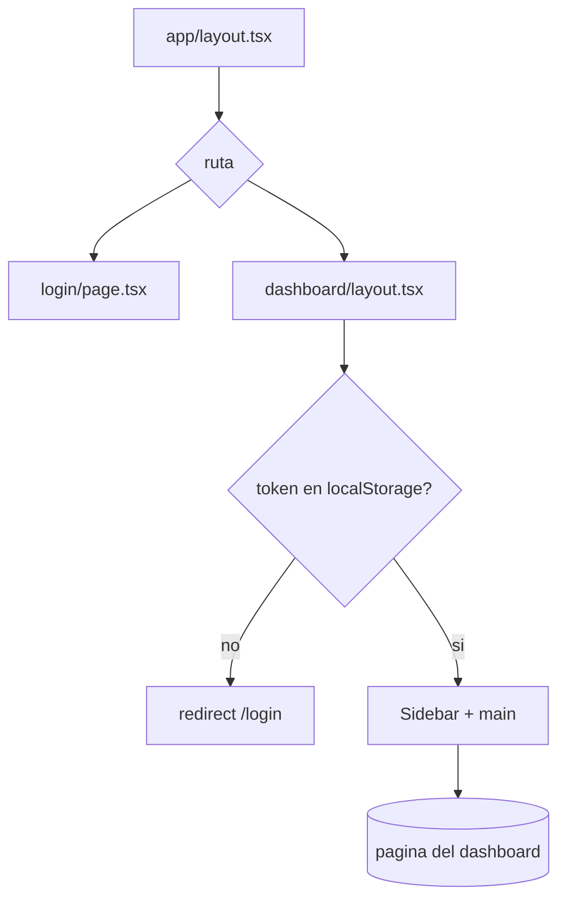
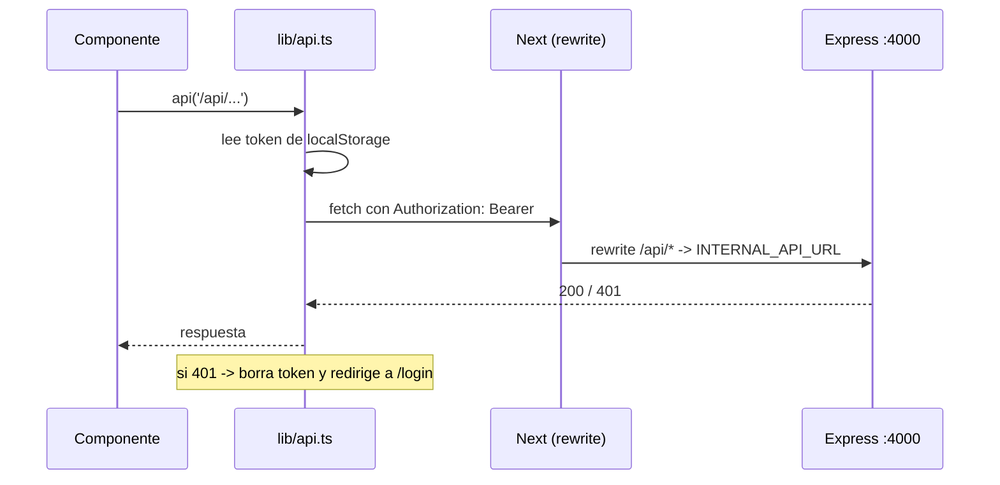

# FRONTEND ARCHITECTURE

> Panel administrativo de JW-REMINDERS. Carpeta: `apps/web`. Framework: Next.js 14 (App Router) + React 18. Puerto 3001.
> Estilos: Tailwind CSS con paleta Apple (ver `DESIGN.md`). Sin librerias de estado externas.

---

## 1. Estructura

```
apps/web/src/
├── app/                      # App Router (rutas = carpetas)
│   ├── layout.tsx            # Layout raiz (fuentes, <html>)
│   ├── page.tsx              # Entrada -> redirige a /login o /dashboard
│   ├── login/page.tsx        # Login (guarda JWT en localStorage)
│   └── dashboard/
│       ├── layout.tsx        # Guard de sesion + Sidebar (envuelve todo el panel)
│       ├── page.tsx          # CENTRO OPERATIVO (dashboard principal)
│       ├── programas/...     # Programas, detalle [id], propuesta
│       ├── semanas/...       # Semanas, detalle [id] (+ AssignmentForm/Reminders)
│       ├── automatizaciones/page.tsx
│       ├── importar/page.tsx
│       ├── publicadores/page.tsx
│       ├── plantillas/page.tsx
│       ├── historial/page.tsx
│       ├── whatsapp/page.tsx
│       └── configuracion/page.tsx
├── components/               # UI reutilizable
└── lib/api.ts                # Cliente HTTP (fetch + Bearer + 401)
```

Patron: cada pantalla es un Client Component (`'use client'`) que carga datos con `lib/api.ts` y renderiza con los componentes compartidos. No hay server actions ni data fetching en servidor: el panel es una SPA servida por Next.

---

## 2. Layout y navegacion



- `dashboard/layout.tsx`: verifica el token en `localStorage`; si falta, redirige a `/login`. Renderiza `Sidebar` + contenedor principal responsive (drawer en movil, sidebar fija en escritorio).
- `Sidebar.tsx`: navegacion (Dashboard, Publicadores, Programas, Importar, Semanas, Automatizaciones, Historial, Plantillas, WhatsApp, Configuracion). Resalta la ruta activa por `startsWith`. Maneja drawer movil (overlay, Escape, lock de scroll) y "Cerrar sesion".

Rutas dinamicas: `programas/[id]`, `programas/[id]/propuesta`, `semanas/[id]`.

---

## 3. Comunicacion con la API

`lib/api.ts` centraliza el acceso:



- Adjunta `Authorization: Bearer <token>` y `Content-Type: application/json`.
- En `401`: limpia el token y redirige a `/login`.
- En produccion, `next.config.js` reescribe `/api/*` a `INTERNAL_API_URL` (red interna Docker), por lo que el navegador no llama directo a la API.

No hay React Query/SWR: cada pagina hace su `fetch` con `useEffect` y guarda en `useState`. El Centro Operativo agrega auto-refresh cada 30s (cuando la pestana esta visible).

---

## 4. Pantallas principales

| Ruta | Proposito |
|---|---|
| `/dashboard` | **Centro Operativo**: estado del sistema, programas, semanas, propuestas, automatizaciones, publicadores, flujo, alertas, calendario, acciones rapidas, y las 5 preguntas UX. Consume `GET /api/dashboard`. |
| `/dashboard/programas` | Lista de programas + crear + ver detalle. |
| `/dashboard/programas/[id]` | Detalle: metricas, completitud, semanas, acciones masivas (con `ConfirmModal`), enlace a propuesta. |
| `/dashboard/programas/[id]/propuesta` | Vista de propuesta: editar asignado/acompanante, regenerar, aprobar, descartar. |
| `/dashboard/semanas` y `/semanas/[id]` | Semanas y detalle (asignaciones + recordatorios por asignacion). |
| `/dashboard/automatizaciones` | Centro de Automatizaciones: filtros, agrupado por dia, detalle, retry/cancel. |
| `/dashboard/importar` | Importar Programa: proveedor, previsualizar, validar, confirmar. |
| `/dashboard/publicadores` | CRUD publicadores. |
| `/dashboard/plantillas` | Plantillas de mensaje. |
| `/dashboard/historial` | Historial de mensajes. |
| `/dashboard/whatsapp` | Estado/QR/acciones de la sesion WhatsApp. |
| `/dashboard/configuracion` | AppConfig (zona horaria, hora de envio, TEST_MODE). |

---

## 5. Componentes y "hooks"

Componentes compartidos (`components/`): `Button`, `Card`, `Badge`, `Input`, `StatusDot`, `EmptyState`, `ConfirmModal`, `Sidebar`, `MetricsPanel`, `WorkflowGuide`, `icons/workflow-icons`. `index.ts` re-exporta los principales.

- **ConfirmModal**: modal de confirmacion reutilizable (tonos default/danger/warning, cierre con Esc/overlay). **Sustituye a `window.confirm`/`alert`** en todas las acciones sensibles. Regla del proyecto: no se usan `alert()`/`confirm()` nativos.
- No hay hooks personalizados formales (`hooks/`): el estado se maneja con `useState`/`useEffect`/`useCallback`/`useMemo` por pagina. El "hook" de datos de facto es `lib/api.ts`.
- No hay React Context/providers de estado global: la sesion vive en `localStorage`; cada pagina es autonoma.

---

## 6. Diseno

- Paleta y tipografia definidas en `DESIGN.md` (estilo Apple). Tailwind extiende los tokens en `tailwind.config.ts`: `ink`, `graphite`, `fog`, `snow`, `azure`, `silver-mist`, `caution`; radios `card` (28px) y `pill`.
- Reglas duras: **sin emojis**, **sin colores fuera de la guia**, **sin `alert()`/`confirm()`**, **responsive completo** (movil/tablet/escritorio sin scroll horizontal roto).
- Feedback al usuario: toasts in-page y tarjetas informativas (no dialogos nativos).

---

## 7. Build y runtime

- `next build`. En produccion usa `output: 'standalone'` (imagen Docker ligera). En local se puede desactivar con `NEXT_OUTPUT=default` para evitar el problema de symlink de Windows.
- Sirve en el puerto 3001 (`next start -p 3001`).
- Dependencias: `next`, `react`, `react-dom`, `tailwindcss`, `@jw-reminders/shared` (para etiquetas/enums compartidos).

---

## 8. Como agregar una pantalla

1. Crear `app/dashboard/<ruta>/page.tsx` como Client Component.
2. Cargar datos con `api('/api/...')` en `useEffect`.
3. Reutilizar componentes (`Card`, `Button`, `ConfirmModal`, ...). Respetar la paleta.
4. Si necesita navegacion, agregar el item en `Sidebar.tsx`.
5. Para acciones destructivas, usar `ConfirmModal` (nunca `confirm()`).
