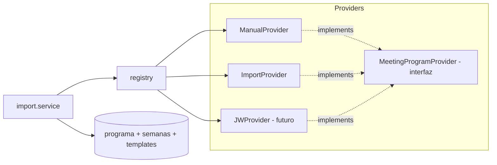
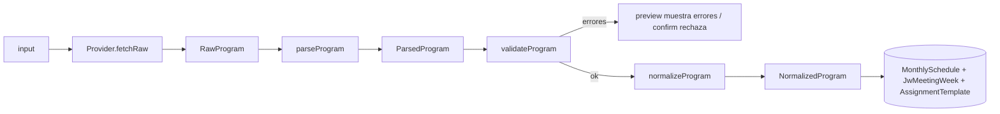
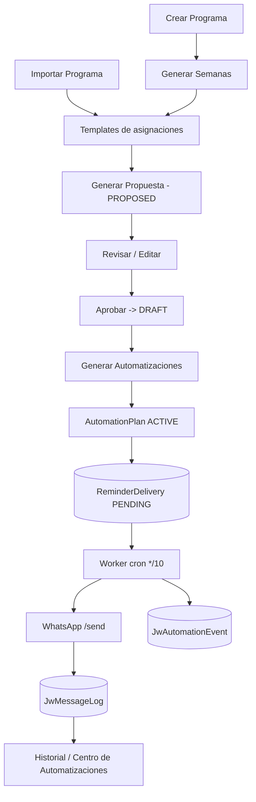
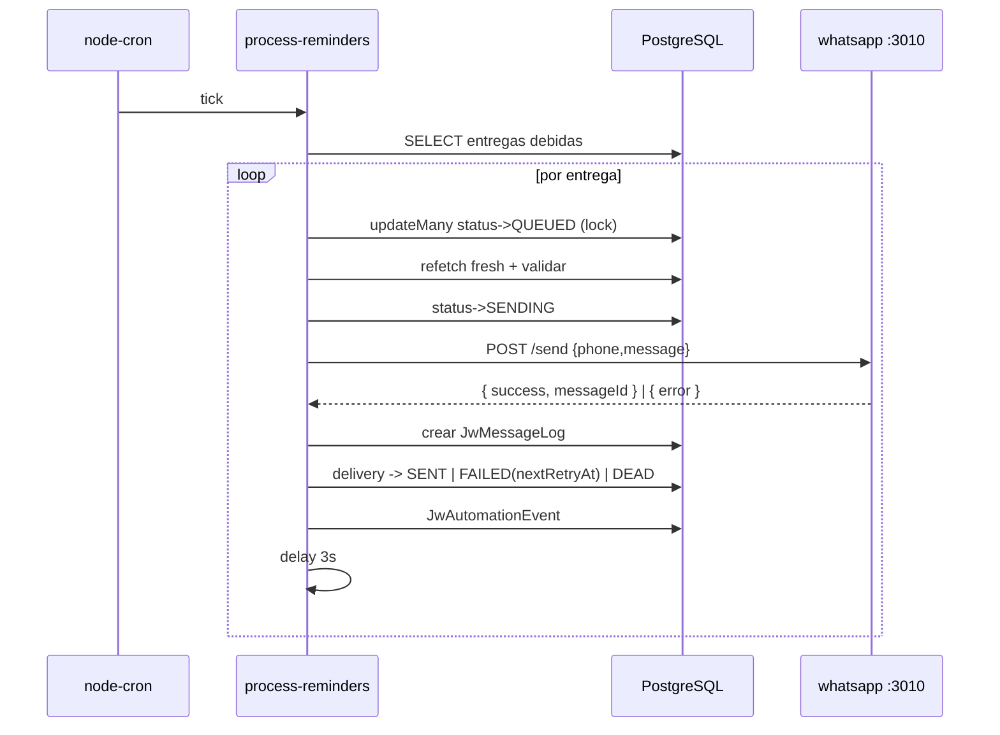
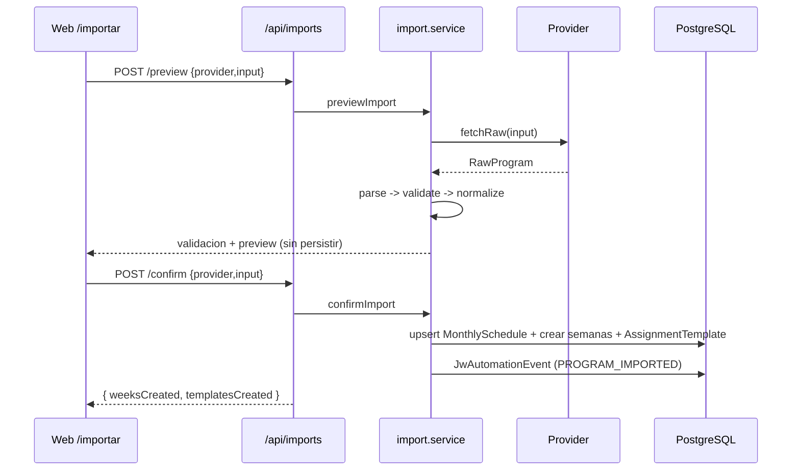
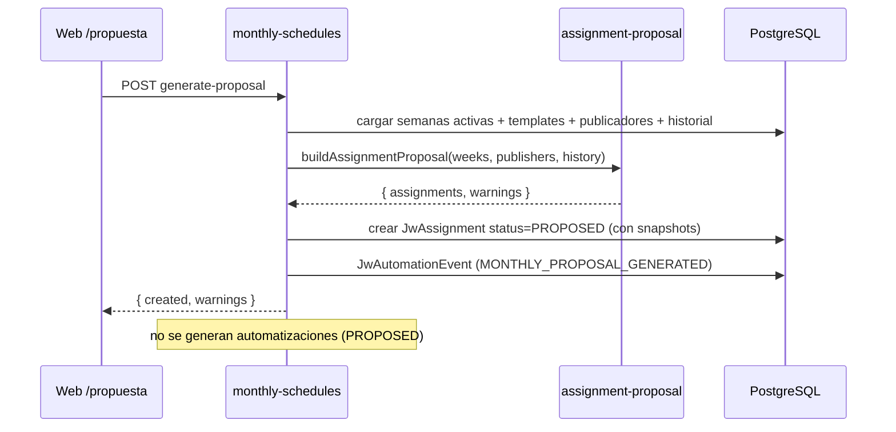
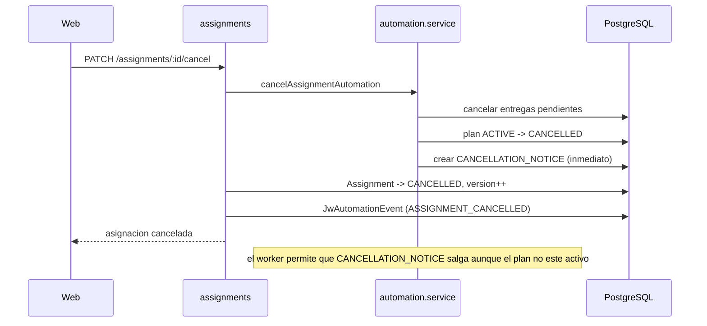

# PROVIDERS ARCHITECTURE + FLUJO OPERATIVO + SECUENCIAS

> Capa de integracion desacoplada para importar programas, el flujo operativo completo y los diagramas de secuencia de las operaciones clave.
> Carpeta backend: `apps/api/src/services/providers/` + `import.service.ts`.

---

## 1. Por que una capa de Providers

El sistema **no depende** de ninguna fuente concreta de programas. Todo el motor de importacion consume una unica interfaz `MeetingProgramProvider`. Asi se puede cambiar de fuente (manual, archivo, futura integracion oficial) sin tocar el resto del sistema. Decision y base legal: `docs/P4-JW-SOURCE-RESEARCH.md`.



---

## 2. La interfaz

`types.ts` define:

```ts
interface MeetingProgramProvider {
  id: string;            // "manual" | "import" | "jw"
  name: string;
  description: string;
  available: boolean;    // jw -> false
  inputHint: string;     // que entrada espera
  fetchRaw(input): Promise<RawProgram>;  // sin efectos en BD
}
```

Y las formas canonicas del pipeline: `RawProgram` (salida cruda del provider) -> `ParsedProgram` (intermedio laxo) -> `NormalizedProgram` (listo para persistir). Presets de partes: `STANDARD_PARTS` (4) y `EXTENDED_PARTS` (6). `NO_COMPANION_TYPES = [BIBLE_READING, TALK]`.

`registry.ts`: `listProviders()` y `getProvider(id)` (lanza error si no existe o `available=false`).

---

## 3. Providers implementados

| Provider | `id` | `available` | Que hace |
|---|---|---|---|
| ManualProvider | `manual` | si | Genera la estructura estandar del mes (semanas del dia/hora indicados + partes preset). No consulta fuentes externas. |
| ImportProvider | `import` | si | Ingiere un JSON estructurado que el admin aporta (objeto o texto). Solo datos operativos. |
| JWProvider | `jw` | no | Stub documentado. Reservado para una futura integracion basada en el EPUB oficial que el admin descargue, sujeto a revision legal. Lanza error explicativo si se invoca. |

---

## 4. Pipeline de importacion (Fase 3)



- **parseProgram**: coercion laxa (acepta alias de campos: `meetingDate`/`date`, `type`/`assignmentType`, etc.).
- **validateProgram**: valida ano/mes, fechas `YYYY-MM-DD`, hora `HH:MM`, seccion/tipo/sala validos, titulos presentes; produce `errors`/`warnings`.
- **normalizeProgram**: calcula el lunes de cada semana, ordena y **renumera secuencial** (garantiza unicidad por semana), infiere seccion y `needsCompanion` por tipo.
- **previewImport**: ejecuta hasta normalizar **sin persistir**; marca que semanas ya existen.
- **confirmImport**: en transaccion, upsert del programa, crea semanas (READY) **sin duplicar** y crea `AssignmentTemplate` por parte. **No asigna personas**. Emite `PROGRAM_IMPORTED`.

Endpoints (`/api/imports`): `GET /providers`, `POST /preview`, `POST /confirm`.

---

## 5. Como agregar un nuevo Provider

1. Crear `apps/api/src/services/providers/<nuevo>.provider.ts` que implemente `MeetingProgramProvider` y exponga `fetchRaw(input)` devolviendo un `RawProgram` con `data` en una forma que el parser entienda (o adaptarla en el parser).
2. Registrarlo en `registry.ts` (anadir a la lista `PROVIDERS`).
3. Nada mas cambia: el motor (`import.service`), los endpoints y la UI lo descubren automaticamente via `listProviders()`.
4. Si la fuente requiere un parser distinto, anadir el caso en `parseProgram` manteniendo la salida `ParsedProgram` canonica.

Esta es la razon de la capa: **extensibilidad sin modificar el resto**.

---

## 6. Flujo operativo completo



Hay dos entradas equivalentes al ciclo: **crear** un programa y generar semanas, o **importar** un programa (que crea semanas + plantillas). Ambas convergen en las plantillas, de donde parte la propuesta.

---

## 7. Diagramas de secuencia

### 7.1 Generar automatizaciones

```mermaid
sequenceDiagram
  participant UI as Web
  participant API as monthly-schedules / assignments
  participant AUT as automation.service
  participant DB as PostgreSQL
  UI->>API: POST generate-automations
  API->>AUT: createAutomationPlanForAssignment(tx, id)
  AUT->>DB: nextPlanVersion
  AUT->>DB: crear AutomationPlan (DRAFT)
  AUT->>AUT: buildDeliveryRows (reglas; omite invalidas)
  AUT->>DB: createMany ReminderDelivery (PENDING)
  AUT->>DB: AutomationPlan -> ACTIVE; Assignment -> SCHEDULED
  AUT->>DB: JwAutomationEvent (REMINDERS_GENERATED)
  API-->>UI: { created }
  Note over AUT: asignaciones PROPOSED se omiten
```

### 7.2 Enviar mensaje (worker)



### 7.3 Importar programa



### 7.4 Generar propuesta



### 7.5 Aprobar propuesta

```mermaid
sequenceDiagram
  participant UI as Web /propuesta
  participant API as monthly-schedules
  participant DB as PostgreSQL
  UI->>API: POST approve-proposal
  API->>DB: JwAssignment PROPOSED -> DRAFT (updateMany)
  API->>DB: JwAutomationEvent (MONTHLY_PROPOSAL_APPROVED)
  API-->>UI: { approved }
  Note over API: crea asignaciones reales; NO genera automatizaciones
```

### 7.6 Editar asignacion

```mermaid
sequenceDiagram
  participant UI as Web
  participant API as assignments
  participant AUT as automation.service
  participant DB as PostgreSQL
  UI->>API: PUT /assignments/:id
  API->>DB: update + applyAssignmentSnapshots + version++
  API->>DB: JwAutomationEvent (ASSIGNMENT_UPDATED)
  alt tiene automatizacion activa
    API->>AUT: regenerateAssignmentAutomation
    AUT->>DB: plan -> SUPERSEDED; cancelar pendientes
    AUT->>DB: nuevo plan + entregas + CHANGE_NOTICE (inmediato)
  end
  API-->>UI: asignacion actualizada
```

### 7.7 Cancelar asignacion



---

## 8. Resumen de garantias

- Importar nunca asigna personas ni envia mensajes (solo estructura + plantillas).
- Proponer no es definitivo; aprobar crea asignaciones; generar automatizaciones es un paso explicito posterior.
- Editar/cancelar una asignacion con automatizacion activa regenera/cancela de forma versionada y auditada.
- Toda la integracion externa pasa por la interfaz Provider y puede reemplazarse sin tocar el motor ni la UI.
