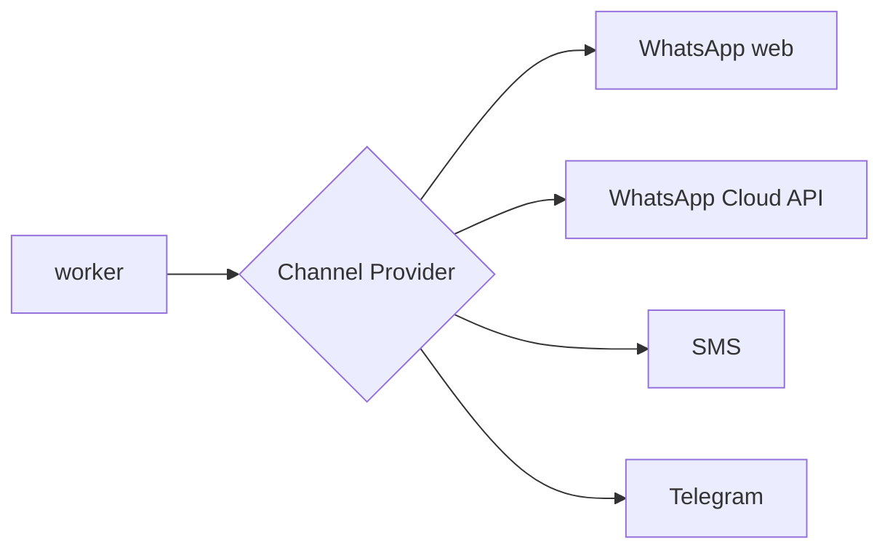

# SCALABILITY

> Como crecera JW-REMINDERS. Estado actual: disenado para **una congregacion** (un programa por mes, un numero de WhatsApp). Este documento traza el camino hacia multi-congregacion, multi-pais/idioma y nuevos canales.

---

## 1. Cuellos de botella actuales (por componente)

| Componente | Limite hoy | Cuando duele |
|---|---|---|
| WhatsApp (1 sesion/numero) | Una sola sesion `whatsapp-web.js` | Mas de una congregacion con numeros distintos |
| Worker (1 instancia, cron 10 min) | Lote `WORKER_BATCH_SIZE=50`, secuencial con `delay 3s` | Cientos/miles de envios concurrentes |
| Modelo de datos (sin `congregationId` activo) | Todo asume una congregacion | Multi-tenant |
| Auth (rol unico) | Sin RBAC ni tenant | Varios administradores/congregaciones |
| PostgreSQL (una instancia) | Suficiente para el volumen actual | Millones de filas en `ReminderDelivery`/`JwMessageLog` |

El campo `JwPublisher.congregationId` (y `metadata`) **ya existe** en el esquema, preparado para multi-tenant sin migracion disruptiva.

---

## 2. Escalado por etapas

### 10 congregaciones
- **Datos**: introducir una tabla `Congregation` y propagar `congregationId` a `MonthlySchedule`, `JwMeetingWeek`, `JwPublisher`, `AppConfig` (config por congregacion). Filtrar todas las consultas por tenant.
- **Auth**: roles (admin global / admin de congregacion) y scoping de tokens por congregacion.
- **WhatsApp**: una sesion por congregacion (numero propio) o un numero compartido con remitente identificado. Ejecutar N instancias del servicio WhatsApp o una multi-sesion.
- **Worker**: sigue siendo viable una sola instancia; el lote y la frecuencia se ajustan. Considerar particionar el `SELECT` por congregacion.
- **Infra**: PostgreSQL unico con indices ya presentes; sin cambios mayores.

### 100 congregaciones
- **Worker**: pasar de "cron + tabla" a **cola real** (Redis/BullMQ o SQS) con varios consumidores. La tabla `ReminderDelivery` sigue siendo la fuente, pero el despacho se paraleliza con locking distribuido (ya hay base: el lock optimista por estado).
- **WhatsApp**: pool de sesiones gestionado (un orquestador asigna numero<->congregacion); aislar cada sesion en su contenedor por estabilidad de Chromium.
- **Datos**: indices compuestos con `congregationId` al frente; archivado/particion de `JwMessageLog` y `JwAutomationEvent` por fecha.
- **Observabilidad**: metricas por tenant (envios, fallos, latencia), no solo logs.

### 1000 congregaciones / multi-pais
- **Particionamiento**: particionar `ReminderDelivery`, `JwMessageLog`, `JwAutomationEvent` por tiempo y/o tenant; read replicas para dashboards.
- **Despacho**: workers autoescalables por region; colas por region para respetar husos horarios.
- **WhatsApp**: migrar al **WhatsApp Business Platform / Cloud API** oficial (mas estable y escalable que `whatsapp-web.js`) o a un proveedor (Twilio, 360dialog). El desacople de canal (ver seccion 4) hace esto sustituible.
- **Multi-region**: desplegar API/worker por region; PostgreSQL con replicas o sharding por pais.

---

## 3. Multi-idioma

- Las etiquetas de dominio estan centralizadas en `packages/shared/constants` (mapas en espanol) y las plantillas en `JwMessageTemplate` (editables por tipo).
- Para i18n: anadir `locale` a `AppConfig`/`Congregation`, versionar `JwMessageTemplate` por idioma (`type` + `locale`), e internacionalizar la UI (next-intl o similar). El motor de render (`renderTemplate`) ya es agnostico al idioma.

---

## 4. Nuevos canales de envio

Hoy el envio esta acoplado al servicio WhatsApp via `whatsapp-client.ts` (HTTP `/send`). Para soportar SMS, Telegram, email o WhatsApp Cloud API:

- Introducir una **interfaz `MessageChannel`** (espejo de la capa de Providers de importacion) con `send(phone/recipient, message)` y un registry.
- `ReminderDelivery` podria llevar un `channel` para elegir destino por preferencia del publicador.
- El worker seleccionaria el canal por configuracion/tenant sin cambiar su logica de cola/reintentos.

La leccion del P4 (capa de Providers desacoplada) es directamente reutilizable para canales de salida.

---

## 5. Nuevos Providers de importacion

Ya soportado por diseno: anadir un provider que implemente la interfaz y registrarlo (ver `PROVIDERS-ARCHITECTURE.md`). El JWProvider oficial (EPUB) es el candidato natural cuando exista viabilidad legal/tecnica.

---

## 6. Recomendaciones priorizadas

1. **Antes de multi-tenant**: activar `congregationId` y scoping (cambio transversal; mejor temprano).
2. **Antes de >100 congregaciones**: cola real para el worker y pool de sesiones WhatsApp.
3. **Para robustez de canal**: abstraer `MessageChannel` y evaluar WhatsApp Cloud API.
4. **Para volumen de historial**: politica de retencion/particion de `JwMessageLog` y `JwAutomationEvent`.

Ninguna de estas requiere reescribir el dominio: el modelo de estados (planes/entregas) y las capas desacopladas estan disenados para crecer.
