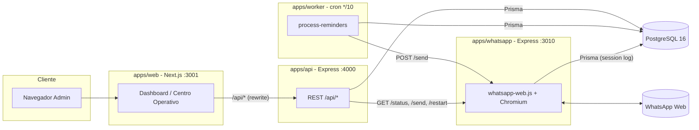
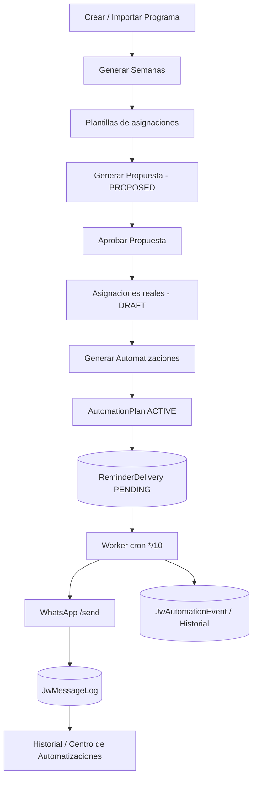
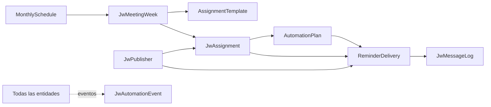

# SYSTEM ARCHITECTURE v1

> Documento maestro de arquitectura de JW-REMINDERS. Congela la arquitectura previa a v1.0.
> Audiencia: cualquier desarrollador nuevo. Objetivo: entender el sistema completo sin leer primero el codigo.

Documentos relacionados: `DATABASE-ARCHITECTURE.md`, `BACKEND-ARCHITECTURE.md`, `FRONTEND-ARCHITECTURE.md`, `WORKER-ARCHITECTURE.md`, `WHATSAPP-ARCHITECTURE.md`, `PROVIDERS-ARCHITECTURE.md`, `PROJECT-TREE.md`, `SCALABILITY.md`, `TECHNICAL-DEBT.md`.

---

## 1. Vision general

JW-REMINDERS administra las asignaciones de la reunion de entre semana ("Vida y Ministerio": Lectura de la Biblia y Seamos mejores maestros) y envia recordatorios automaticos por WhatsApp a los publicadores asignados y a sus acompanantes.

El sistema cubre todo el ciclo operativo:

1. Crear/Importar el **programa mensual**.
2. Generar las **semanas** de reunion del mes.
3. Crear **plantillas de asignaciones** (partes de cada semana).
4. Generar una **propuesta** de asignaciones equilibrada (sin enviar nada).
5. Revisar, editar y **aprobar** la propuesta -> asignaciones reales.
6. Generar **automatizaciones** (planes + entregas programadas).
7. El **worker** envia los recordatorios via **WhatsApp** segun el calendario.
8. Todo queda registrado en **logs** e **historial** auditables.

Principios de diseno:

- **Propuesta antes que accion**: nada se vuelve definitivo ni se envia sin aprobacion manual.
- **Inmutabilidad por snapshots**: cada asignacion guarda nombre/telefono del publicador al momento, para que el historial no cambie si el publicador cambia.
- **Versionado de planes**: las automatizaciones se versionan; regenerar supersede la version anterior en vez de borrarla.
- **Idempotencia y locking**: el worker reclama cada entrega con un lock optimista para evitar envios duplicados.
- **Integracion desacoplada**: la obtencion de programas pasa por una interfaz de Providers intercambiable.
- **Auditabilidad**: cada transicion relevante emite un `JwAutomationEvent`.

---

## 2. Topologia de servicios

Monorepo `pnpm` con cuatro aplicaciones desplegables y dos paquetes compartidos.

| Servicio | Carpeta | Puerto | Responsabilidad |
|---|---|---|---|
| API | `apps/api` | 4000 | REST, reglas de negocio, motor de automatizaciones, generador de propuestas, motor de importacion, auth |
| Web | `apps/web` | 3001 | Panel administrativo (Next.js App Router); consume la API |
| Worker | `apps/worker` | - | Cron cada 10 min: procesa y envia las entregas debidas |
| WhatsApp | `apps/whatsapp` | 3010 | Sesion de WhatsApp Web (QR), endpoint de envio y estado |
| database (pkg) | `packages/database` | - | Esquema Prisma, migraciones, cliente compartido |
| shared (pkg) | `packages/shared` | - | Enums, constantes, validadores, utilidades (render de plantillas) |

Los cuatro servicios son **stateless** salvo la sesion de WhatsApp (estado en disco) y comparten el **unico estado real** en PostgreSQL.

---

## 3. Responsabilidades por servicio

### API (`apps/api`)
- Autenticacion JWT (Bearer) y middleware de proteccion.
- CRUD de publicadores, programas, semanas, asignaciones, plantillas de mensaje, configuracion.
- **Motor de automatizaciones** (`services/automation.service.ts`): crea/regenera/cancela/archiva planes y entregas.
- **Generador de propuestas** (`services/assignment-proposal.ts`): algoritmo de scoring puro.
- **Motor de importacion** (`services/import.service.ts` + `services/providers/*`).
- **Centro de Automatizaciones** (`modules/automation-center`): supervision y acciones (retry/cancel).
- **Centro Operativo** (`modules/dashboard/operational-center.service.ts`): agregacion para el dashboard.
- Proxy de estado/acciones de WhatsApp (`modules/whatsapp`).

### Web (`apps/web`)
- Panel admin con Next.js App Router. Pagina principal: **Centro Operativo** (`/dashboard`).
- No tiene logica de negocio: consume `/api/*` (reescritura interna a la API).
- Sesion: token JWT en `localStorage`; redireccion a login en 401.

### Worker (`apps/worker`)
- `node-cron` con expresion `CRON_SCHEDULE` (default `*/10 * * * *`).
- Selecciona entregas debidas, las reclama (lock), valida estado, renderiza el mensaje, llama a WhatsApp, registra el log y actualiza la entrega con reintentos/backoff.

### WhatsApp (`apps/whatsapp`)
- Mantiene una sesion `whatsapp-web.js` con `LocalAuth` (persistencia en disco).
- Expone estado (incluido QR) y un endpoint de envio. No reintenta: el reintento lo gobierna el worker.

---

## 4. Comunicacion entre componentes

- **Web -> API**: HTTP REST. En produccion, Next.js reescribe `/api/*` a `INTERNAL_API_URL` (red interna de Docker). El navegador nunca habla directo con la API publica.
- **API -> DB / Worker -> DB / WhatsApp -> DB**: Prisma Client (`packages/database`). PostgreSQL es el unico punto de verdad.
- **Worker -> WhatsApp**: `POST {WHATSAPP_API_URL}/send` con `{ phone, message }`.
- **API -> WhatsApp**: `GET /status`, `POST /send|/restart|/disconnect|/generate-qr` (proxied a la UI).
- **Estado compartido**: ninguno en memoria entre servicios; toda coordinacion ocurre via filas y estados en PostgreSQL (incl. locking optimista).

No hay colas externas (Redis/RabbitMQ): la "cola" es la tabla `ReminderDelivery` consultada por el worker. Ver `WORKER-ARCHITECTURE.md`.

---

## 5. Flujo completo del sistema

Estados clave por entidad (resumen; detalle en `DATABASE-ARCHITECTURE.md`):

- **MonthlySchedule**: DRAFT -> ACTIVE -> COMPLETED / ARCHIVED / CANCELLED.
- **JwMeetingWeek**: DRAFT -> READY -> ACTIVE -> COMPLETED / ARCHIVED / CANCELLED.
- **JwAssignment**: PROPOSED -> DRAFT -> SCHEDULED -> COMPLETED / CANCELLED.
- **AutomationPlan**: DRAFT -> ACTIVE -> SUPERSEDED / CANCELLED / ARCHIVED.
- **ReminderDelivery**: PENDING -> QUEUED -> SENDING -> SENT | FAILED -> (retry) | DEAD | SKIPPED | CANCELLED.

---

## 6. Modelo de datos (alto nivel)

Detalle completo (tablas, enums, indices, constraints, cascadas y diagrama ER) en `DATABASE-ARCHITECTURE.md`.

---

## 7. Stack tecnologico

| Capa | Tecnologia | Version |
|---|---|---|
| Lenguaje | TypeScript | 5.6.3 |
| Runtime | Node.js | >= 20 (contenedores node:20-slim) |
| Gestor | pnpm workspaces | >= 9 |
| API | Express | 4.21 |
| ORM | Prisma | 5.22 (+ @prisma/client) |
| Base de datos | PostgreSQL | 16 |
| Frontend | Next.js (App Router) + React | 14.2 / 18.3 |
| Estilos | Tailwind CSS | 3.4 (paleta Apple, ver `DESIGN.md`) |
| Cron | node-cron | 3.0 |
| WhatsApp | whatsapp-web.js + puppeteer/Chromium | 1.34 |
| Auth | jsonwebtoken + bcryptjs | 9 / 2.4 |
| Validacion | zod | 3.23 |
| Contenedores | Docker + Docker Compose | - |
| Orquestacion deploy | Dokploy | API `compose.deploy` |

Quien depende de quien y por que: ver `BACKEND-ARCHITECTURE.md` seccion Dependencias y `TECHNICAL-DEBT.md`.

---

## 8. Configuracion y entorno

Variables principales (ver `.env.example`):

| Variable | Usado por | Rol |
|---|---|---|
| `DATABASE_URL` | api, worker, whatsapp, database | Conexion PostgreSQL |
| `JWT_SECRET` | api | Firma/verificacion de tokens |
| `WHATSAPP_API_URL` | api, worker | URL del servicio WhatsApp |
| `WHATSAPP_SESSION_PATH` | whatsapp | Ruta de persistencia de sesion |
| `CRON_SCHEDULE` | worker | Frecuencia del cron (default `*/10 * * * *`) |
| `WORKER_BATCH_SIZE` | worker | Maximo de entregas por tick (default 50) |
| `INTERNAL_API_URL` / `NEXT_PUBLIC_API_URL` | web | Destino de reescritura de `/api/*` |
| `NEXT_OUTPUT` | web (build) | `default` desactiva el output standalone (builds locales) |

**Configuracion operativa en DB** (`AppConfig`, editable desde el panel y leida en caliente por el worker): `TIMEZONE`, `REMINDER_SEND_HOUR`, `TEST_MODE`, `TEST_PHONE`, `CONGREGATION_NAME`.

`TEST_MODE=true` redirige todos los envios a `TEST_PHONE` (no se envia a publicadores reales).

---

## 9. Despliegue

- Imagenes Docker por servicio (`apps/*/Dockerfile`); orquestadas por `docker-compose.yml` (prod) / `docker-compose.local.yml` (local).
- El contenedor de API ejecuta al arrancar: `prisma migrate deploy` + `seed` y luego `node dist/server.js`. Por eso **las migraciones se aplican solas en cada deploy**.
- Produccion en **Dokploy** (servicio compose `jw-reminders-stack`). El redeploy correcto cuando el webhook de GitHub no dispara es via API: `POST /api/compose.deploy { composeId }`. Procedimiento completo en `docs/DEPLOY-DOKPLOY.md`.
- URL de produccion: `https://jw-reminders.duckdns.org`.

---

## 10. Seguridad (estado actual)

- Autenticacion por JWT Bearer; todas las rutas excepto `/api/auth/*` requieren token.
- Contrasenas con bcrypt.
- No hay multi-tenant ni RBAC: un unico rol administrador (ver `SCALABILITY.md` y `TECHNICAL-DEBT.md`).
- El servicio WhatsApp y el worker no exponen auth propia; se asumen accesibles solo dentro de la red interna de Docker. **Riesgo documentado** en `TECHNICAL-DEBT.md`.

---

## 11. Como leer el resto de la documentacion

1. `PROJECT-TREE.md` — mapa de carpetas.
2. `DATABASE-ARCHITECTURE.md` — el modelo de datos es el corazon del sistema.
3. `BACKEND-ARCHITECTURE.md` — modulos, servicios, motor de automatizaciones.
4. `PROVIDERS-ARCHITECTURE.md` — importacion + flujo operativo + diagramas de secuencia.
5. `WORKER-ARCHITECTURE.md` y `WHATSAPP-ARCHITECTURE.md` — el camino del envio.
6. `FRONTEND-ARCHITECTURE.md` — la capa de presentacion.
7. `SCALABILITY.md` y `TECHNICAL-DEBT.md` — futuro y auditoria.
