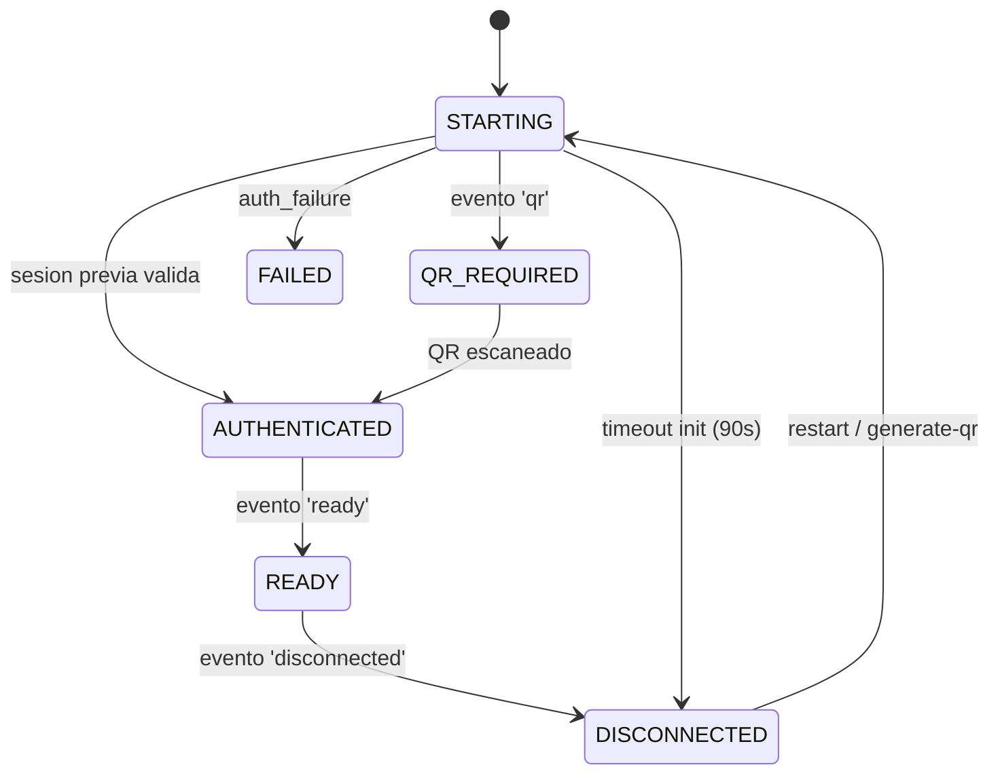
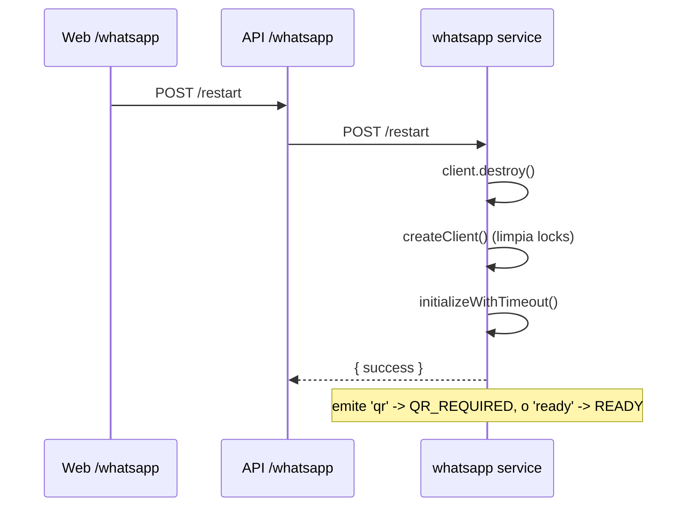

# WHATSAPP ARCHITECTURE

> Servicio de sesion y envio por WhatsApp. Carpeta: `apps/whatsapp`. Express :3010.
> Libreria: `whatsapp-web.js` (automatiza WhatsApp Web via Chromium/puppeteer). Persistencia: `LocalAuth` en disco.

---

## 1. Componentes

| Archivo | Rol |
|---|---|
| `src/index.ts` | Servidor Express: `/health`, `/status`, `/send`, `/restart`, `/disconnect`, `/generate-qr`. |
| `src/client/whatsapp.ts` | Cliente `whatsapp-web.js`, maquina de estado, manejo de QR/sesion, limpieza de locks. |
| `src/services/message-sender.ts` | Validacion de numero + envio. |

Este servicio es el unico con **estado no transaccional**: la sesion de WhatsApp vive en el sistema de archivos (`WHATSAPP_SESSION_PATH`, default `.wwebjs_auth`) y el estado en memoria del modulo.

---

## 2. Sesiones y persistencia

- `LocalAuth({ dataPath })` guarda las credenciales de la sesion en disco. En produccion ese path se monta como **volumen Docker** (`whatsapp_session`) para sobrevivir reinicios del contenedor.
- Chromium corre **headless** con flags endurecidos para contenedores: `--no-sandbox`, `--disable-dev-shm-usage`, `--single-process`, `--disable-gpu`, etc.
- **Limpieza de locks**: antes de crear el cliente se borran archivos `Singleton*` (lock de Chromium) que quedan tras un apagado abrupto y que impedirian relanzar el navegador. Se usa `find ... -delete` con fallback recursivo.

---

## 3. Maquina de estado de la sesion

Estado en variables de modulo (`status`, `lastQR`, `connectedNumber`, `lastConnected`, `lastDisconnected`, `lastError`) y, en paralelo, cada transicion se persiste en `JwWhatsappSessionLog`.

- `STARTING`: inicializando el cliente.
- `QR_REQUIRED`: hay un QR que el admin debe escanear (se expone en `/status` y se imprime en consola).
- `AUTHENTICATED` -> `READY`: sesion lista para enviar.
- `DISCONNECTED` / `FAILED`: estados accionables desde la UI.

**Timeout de init**: si `initialize()` no progresa en 90s, se pasa a `DISCONNECTED` (evita quedarse "colgado" en `STARTING`). Los eventos `qr`/`ready`/`authenticated` cancelan el timeout porque indican progreso.

---

## 4. Endpoints

| Metodo | Ruta | Descripcion |
|---|---|---|
| GET | `/health` | Liveness simple. |
| GET | `/status` | Estado actual + QR + numero/dispositivo conectado + ultimas fechas + error. |
| POST | `/send` | `{ phone, message }` -> envia (usado por el worker). |
| POST | `/restart` | Destruye y recrea el cliente, reinicia sesion. |
| POST | `/disconnect` | Logout + recrea cliente limpio. |
| POST | `/generate-qr` | Fuerza un QR nuevo (desconecta si estaba READY). |

La API (`/api/whatsapp`) y la UI (`/dashboard/whatsapp`) consumen estos endpoints para mostrar estado y operar la sesion.

---

## 5. Reconexion y ciclo de vida del cliente

`whatsapp-web.js` **no permite re-inicializar** un cliente despues de `destroy()`. Por eso `restart`, `disconnect` y `generate-qr` **recrean** el cliente (`createClient()`), re-registran listeners y re-inicializan con timeout. Esto evita estados zombis y garantiza un punto de partida limpio.

---

## 6. Envio de mensajes

`message-sender.ts`:
1. Valida el numero: debe cumplir `^\d{10,15}$` (solo digitos, 10-15). Si no, error `Invalid phone format`.
2. Exige `status === READY`; si no, devuelve error con el estado actual (el worker lo registra como fallo y reintenta).
3. Construye `chatId = "<phone>@c.us"` y llama `client.sendMessage(chatId, message)`.
4. Devuelve `{ success, messageId }` o `{ success: false, error }`.

**Sin reintento interno**: el servicio reporta el resultado y el **worker** decide reintentos/backoff. Esto mantiene una unica autoridad de reintentos (la tabla `ReminderDelivery`).

---

## 7. Errores y logs

- Transiciones de sesion -> `JwWhatsappSessionLog` (auditoria) + consola.
- Errores de envio -> devueltos al worker, que crea `JwMessageLog` con `status=FAILED` y `errorMessage`.
- `auth_failure` -> estado `FAILED` con el mensaje.
- Init que falla/expira -> `DISCONNECTED` con causa, para que la UI muestre accion ("Generar QR"/"Reiniciar").

---

## 8. Riesgos y consideraciones

- **Un solo numero/sesion**: el servicio mantiene una unica sesion. Multi-congregacion con numeros distintos requiere multiples instancias o una sesion por tenant (ver `SCALABILITY.md`).
- **Dependencia de WhatsApp Web no oficial**: `whatsapp-web.js` puede romperse ante cambios de WhatsApp; es el punto mas fragil del sistema (ver `TECHNICAL-DEBT.md`).
- **Sin autenticacion propia**: confia en el aislamiento de red interna. Exponerlo publicamente seria critico.
- **Estado en disco**: respaldar el volumen de sesion evita re-escanear el QR tras un redeploy.
