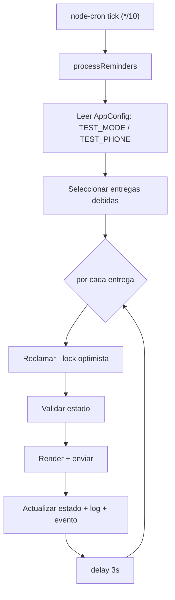
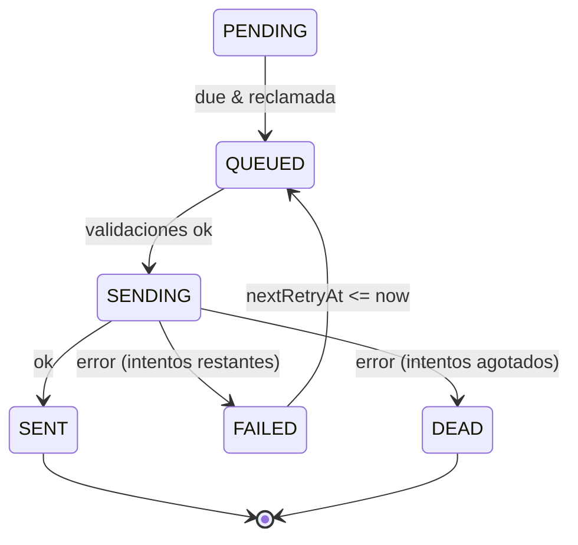

# WORKER ARCHITECTURE

> Servicio de envio diferido. Carpeta: `apps/worker`. Sin HTTP: es un proceso cron.
> Procesa la tabla `ReminderDelivery` (la "cola") y envia via el servicio WhatsApp.

---

## 1. Componentes

| Archivo | Rol |
|---|---|
| `src/index.ts` | Arranque: `node-cron` con `CRON_SCHEDULE` (default `*/10 * * * *`) + graceful shutdown (SIGTERM/SIGINT). |
| `src/jobs/process-reminders.ts` | El job: selecciona, reclama, valida, envia y actualiza cada entrega. |
| `src/services/template-renderer.ts` | Renderiza el texto desde `JwMessageTemplate` con variables de la asignacion. |
| `src/services/whatsapp-client.ts` | `POST {WHATSAPP_API_URL}/send` con `{ phone, message }`. |

No hay broker externo (Redis/SQS): **la cola es PostgreSQL**. El indice `ReminderDelivery(status, scheduledAt)` hace eficiente la consulta de "lo que toca enviar".

---

## 2. Scheduler (cron)

`node-cron` ejecuta `processReminders()` cada `CRON_SCHEDULE`. Si un tick lanza error, se captura y se loguea sin tumbar el proceso. El siguiente tick reintenta naturalmente.



---

## 3. Seleccion de trabajo (que se considera "debido")

```sql
WHERE (status = 'PENDING'  AND scheduledAt <= now)
   OR (status = 'FAILED'   AND nextRetryAt <= now)
ORDER BY scheduledAt ASC
LIMIT WORKER_BATCH_SIZE   -- default 50
```

Se incluyen relaciones (`automationPlan`, `assignment.meetingWeek/assigned/companion`, `publisher`) para validar y renderizar sin consultas extra.

---

## 4. Locking (idempotencia / no-duplicados)

Antes de procesar, el worker **reclama** la entrega con un update condicional por estado (lock optimista):

```ts
updateMany({ where: { id, status: <statusActual> }, data: { status: 'QUEUED' } })
// si count === 0 -> otro proceso la tomo; se ignora
```

Esto garantiza que, aunque corran dos workers o dos ticks solapados, **una entrega solo se procesa una vez** (el primero que la pasa a `QUEUED` gana). Tras reclamar, se relee la fila "fresca" (`findUniqueOrThrow`) para validar contra el estado mas reciente.

---

## 5. Validaciones antes de enviar

Tras reclamar, en orden (cualquiera detiene el envio):

| Condicion | Resultado |
|---|---|
| `attemptCount >= maxAttempts` | `DEAD` |
| Falta `automationPlan` / `assignment` / `publisher` | `SKIPPED` |
| Plan `SUPERSEDED` o `CANCELLED` (y no es notice especial) | `CANCELLED` |
| Plan `ARCHIVED` (y no especial) | `SKIPPED` |
| Semana `CANCELLED`/`ARCHIVED` (y no especial) | `CANCELLED` |
| Asignacion `CANCELLED` (y no es `CANCELLATION_NOTICE`) | `CANCELLED` |
| Asignacion `COMPLETED` (y no especial) | `CANCELLED` |
| Publicador inactivo / borrado / `!canReceiveAssignments` | `SKIPPED` |
| Sin telefono utilizable (o TEST_MODE sin TEST_PHONE) | `SKIPPED` |

"Notice especial" = `CHANGE_NOTICE` o `CANCELLATION_NOTICE` (deben salir aunque el plan ya no este activo).

**Modo prueba**: si `TEST_MODE=true`, el destino se fuerza a `TEST_PHONE`; si falta, la entrega se marca `SKIPPED` (no se envia a nadie real). La config se lee de `AppConfig` en cada tick (fallback a env), por lo que cambia sin redeploy.

---

## 6. Envio y registro

1. `status = SENDING`, `lastAttemptAt = now`; evento `REMINDER_SENDING`.
2. `renderReminderMessage` arma el texto desde `JwMessageTemplate` (tipo segun `reminderType`; `INITIAL_NOTICE` se desdobla en `INITIAL_NOTICE_ASSIGNED`/`_COMPANION`). Si no hay plantilla, usa un texto minimo de respaldo.
3. `sendWhatsappMessage(phone, message)` -> `POST /send` al servicio WhatsApp.
4. Se crea **siempre** un `JwMessageLog` (SENT o FAILED) con telefono, cuerpo, `providerMessageId`, error.
5. Se actualiza `ReminderDelivery`:
   - exito -> `SENT`, `sentAt`, limpia error/retry.
   - fallo con intentos restantes -> `FAILED`, `nextRetryAt = now + backoff`.
   - fallo sin intentos -> `DEAD`, `deadAt`.
6. Se emiten eventos (`REMINDER_SENT` / `REMINDER_FAILED` / `REMINDER_DEAD` / `REMINDER_RETRY_SCHEDULED`).
7. `delay(WHATSAPP_SEND_DELAY_MS)` (3s) entre envios para no saturar WhatsApp.

---

## 7. Reintentos y backoff

- `maxAttempts = 3` por entrega.
- Backoff: si el proximo intento es `<= 2` -> **10 min**; si es mayor -> **30 min** (`nextRetryAt`).
- Una entrega `FAILED` vuelve a ser "debida" cuando `nextRetryAt <= now`; el ciclo la retoma.
- Al agotar intentos -> `DEAD` (terminal). El admin puede reactivarla manualmente con "Reintentar" en el Centro de Automatizaciones (resetea `attemptCount` y `scheduledAt`).



---

## 8. Manejo de errores y recovery

- Cada entrega esta envuelta en try/catch: un fallo individual no detiene el lote. En excepcion no controlada, la entrega pasa a `FAILED` con `nextRetryAt = now + 10min` y se incrementa `attemptCount`.
- Un fallo del tick completo se loguea; el proximo tick reintenta. No hay estado en memoria que perder.
- **Recovery natural**: si el worker se reinicia, no pierde trabajo: las entregas siguen en la BD con su estado. Las que quedaron `QUEUED`/`SENDING` por un crash a mitad de envio son un riesgo conocido (podrian no reintentarse automaticamente) — documentado en `TECHNICAL-DEBT.md`.
- Auditoria: cada transicion emite `JwAutomationEvent` con `actorType = "worker"`, lo que permite al Centro Operativo detectar inactividad del worker.

---

## 9. Configuracion

| Variable | Default | Rol |
|---|---|---|
| `CRON_SCHEDULE` | `*/10 * * * *` | Frecuencia del tick |
| `WORKER_BATCH_SIZE` | 50 | Maximo de entregas por tick |
| `WHATSAPP_API_URL` | http://localhost:3010 | Destino de envio |
| `AppConfig.TEST_MODE` / `TEST_PHONE` | - | Modo prueba (leido en caliente) |
| `WHATSAPP_SEND_DELAY_MS` (shared) | 3000 | Pausa entre envios |

---

## 10. Por que este diseno

- **Sin cola externa**: menos infraestructura; PostgreSQL + indices bastan para el volumen actual (una congregacion). El cuello de botella aparece a gran escala (ver `SCALABILITY.md`).
- **Estado en BD**: idempotencia, auditabilidad y recovery sin coordinacion entre procesos.
- **Backoff escalonado**: tolera caidas temporales de WhatsApp sin perder mensajes ni spamear.
